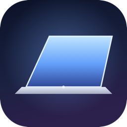

<div align="center">
  

  # MacbookDuo

  **Hiệu ứng đóng nắp kiểu "Duo" cho MacBook của bạn.**

  Khép hờ nắp máy lại — màn hình nghiêng ra sau, mờ dần và tối lại như một tấm kính đang khép, ngay trên chiếc MacBook bạn đang dùng.

  [](#yêu-cầu)
  [](#build-từ-source)

  [**⬇ Tải file .dmg**](../../releases/latest/download/MacbookDuo.dmg) &nbsp;·&nbsp; [Build từ source](#build-từ-source)
</div>

---

## Đây là gì

MacbookDuo là app chạy nền trên thanh menu bar, tự viết từ đầu bằng Swift —
không dùng lại code của bất kỳ ai. Khi bạn khép nắp MacBook lại một góc,
app đọc cảm biến góc bản lề, chụp/stream nội dung màn hình, rồi dùng Metal
để vẽ lại nó dưới dạng một tấm hình phối cảnh nghiêng dần, mờ dần và tối
dần — đúng như cảm giác đang nhìn một tấm kính khép lại.

- **Render bằng GPU (Metal):** phối cảnh, làm mờ và làm tối được tính theo
  thời gian thực, mượt theo từng độ nghiêng của nắp máy.
- **Nội dung màn hình trực tiếp:** dùng ScreenCaptureKit để capture màn
  hình sống động (video vẫn chạy, con trỏ vẫn nhấp nháy) trong lúc hiệu ứng
  hiển thị.
- **Tùy chỉnh được:** góc bắt đầu, độ mờ, độ tối, phối cảnh, độ "ngả" ra
  sau... đều chỉnh được trong Settings.
- **Song ngữ Việt / Anh**, có nút "Xem thử" để thấy hiệu ứng ngay mà không
  cần khép nắp thật.

## Yêu cầu

- MacBook có cảm biến góc bản lề (hầu hết máy từ ~2021 trở lại đây). App
  sẽ tự báo trong Settings nếu máy không có cảm biến này.
- macOS 14 trở lên.

## Cài đặt

1. [Tải file `MacbookDuo.dmg`](../../releases/latest/download/MacbookDuo.dmg) ở trên.
2. Mở file `.dmg`, kéo **MacbookDuo** vào thư mục **Applications**.
3. Mở app lần đầu: vì app **chưa được ký bằng Apple Developer ID trả phí**
   (chỉ cần thiết cho việc phân phối rộng rãi), macOS sẽ cảnh báo *"không
   xác định được nhà phát triển"*. Đây là cảnh báo bình thường với app mã
   nguồn mở dạng này, không phải app bị lỗi hay chứa mã độc — xử lý một
   trong hai cách:
   - Chuột phải (hoặc Control-click) vào **MacbookDuo** trong Applications
     → chọn **Open** → bấm **Open** lần nữa ở hộp thoại hiện ra. Chỉ cần
     làm một lần duy nhất.
   - Hoặc: System Settings → **Privacy & Security**, cuộn xuống thấy dòng
     nhắc về MacbookDuo, bấm **Open Anyway**.
4. Cấp quyền **Screen Recording** khi được hỏi (bắt buộc để hiệu ứng chụp
   được màn hình) — System Settings → Privacy & Security → Screen
   Recording → bật MacbookDuo.
5. App chạy nền trên menu bar (icon hình laptop). Bấm vào đó để mở Settings.

## Build từ source

Yêu cầu Xcode với toolchain Swift 6 trở lên.

```sh
./build.sh --run
```

Lệnh trên build bản release, đóng gói thành `build/MacbookDuo.app` (đã có
icon, đã ký code) và mở app lên. Thêm `--dmg` để đóng gói luôn thành
`build/MacbookDuo.dmg`:

```sh
./build.sh --dmg --run
```

Chạy `swift build` nếu chỉ muốn build nhanh kiểu debug để kiểm tra biên dịch.

### Chữ ký & quyền Screen Recording

Quyền Screen Recording (và các quyền TCC khác của macOS) gắn với đúng chữ
ký code của app. `build.sh` tự tìm chứng chỉ **"Apple Development"** miễn
phí trong Keychain (chứng chỉ Xcode tự tạo khi bạn đăng nhập Apple ID ở
Xcode → Settings → Accounts) và ký bằng chứng chỉ đó — vì định danh chứng
chỉ này ổn định, quyền đã cấp sẽ giữ nguyên qua các lần build lại.

Nếu máy bạn chưa có chứng chỉ đó, script sẽ ký ad-hoc (`SIGN_IDENTITY=-`) —
kiểu ký này tạo định danh mới mỗi lần build, nên macOS sẽ hỏi cấp quyền lại
sau mỗi lần build. Đăng nhập Apple ID trong Xcode một lần để có chứng chỉ
miễn phí, hoặc tự chỉ định chứng chỉ khác:

```sh
SIGN_IDENTITY="Tên chứng chỉ của bạn" ./build.sh --dmg --run
```

(liệt kê chứng chỉ hiện có bằng `security find-identity -v -p codesigning`).

## Xem thử không cần khép nắp

Trong Settings có nút **"Xem thử"** — chạy một đoạn khép/giữ/mở nắp được
dựng sẵn để bạn thấy hiệu ứng ngay, không cần đụng vào nắp máy thật.

## Cấu trúc project

- `Sources/HingeSensorKit/` — thư viện độc lập đọc cảm biến góc bản lề qua
  IOKit HID (usage page `0x20`, usage `0x8A`).
- `Sources/MacbookDuo/` — phần app: capture màn hình
  (`ScreenStillCapture`, `ScreenLiveCapture`), render
  (`EffectRenderer`, `EffectShaderSource`, `PaddedPictureTexture`,
  `Perspective`), state machine điều khiển hiệu ứng (`EffectController`),
  cửa sổ overlay (`EffectOverlayWindow`), và menu bar / Settings UI
  (`MenuBarController`, `SettingsView`).
- `Resources/` — `Info.plist` và `AppIcon.icns`, được `build.sh` copy vào
  app bundle (không phải resource của Swift package).

## Giới hạn hiện tại

- Chỉ áp dụng cho màn hình gắn liền (built-in display).
- Chỉ chạy được trên MacBook có cảm biến góc bản lề.
- Hiệu ứng dừng khi macOS ngủ (sleep) lúc đóng nắp.
- Overlay xuyên click hoàn toàn, không chặn thao tác vào app phía dưới.
